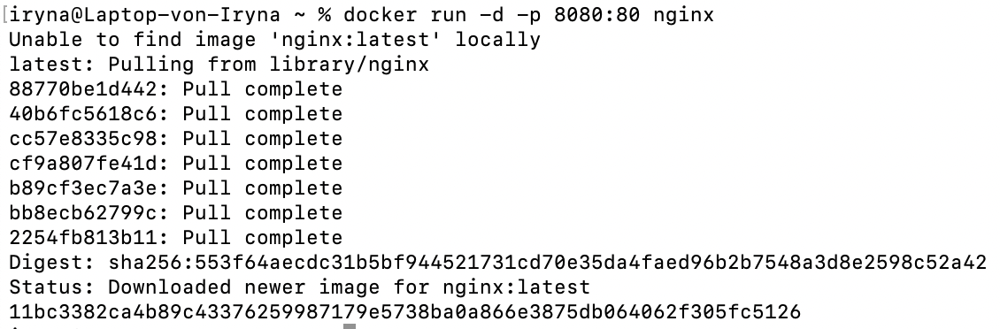
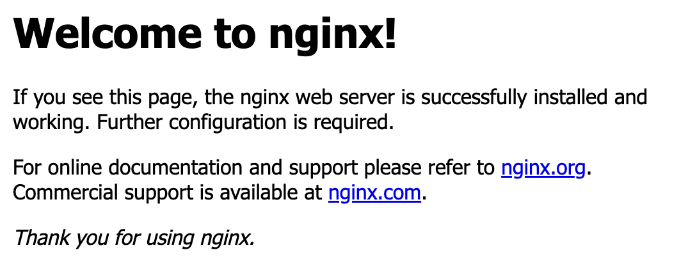
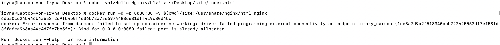

# docker Завдання 2

## - Запустити контейнер із вебсервером:
docker run -d -p 8080:80 nginx

### Результат

## - Відкрити браузер і перейти на http://localhost:8080

### Результат

## - Змінити конфігурацію сторінки:  
### -створити свій index.html.
### - змонтувати директорію через volume:
docker run -d -p 8080:80 -v $(pwd)/site:/usr/share/nginx/html nginx
  
### Результат

